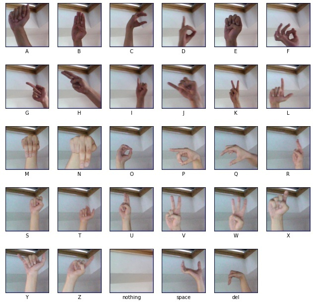
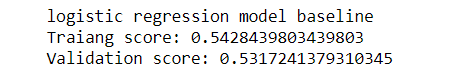

# Sin Language Reognition 
The goal of this project is to build Convelution Neural Network(CNN) 
deep learning models that decide which is the letter based on the shape of the hand in sign language
and bridging the the gap in the process of communication between the Deaf and Dumb people with rest of the world.

## Sample of Dataset

## Workflow
* Baseline Model "Logestic Regresstion" 

 

after visualizing the data, we started to prepare it for baseline model. The data image comes with 4 dimensions first we reshaped data to 2-dimensional data and then we built a logistic regression model. The score is very low as we expected 0.54 on training and 0.53 on validation. We start to build a neural network models and  try to get  better results  on both training and validation .

* Neural Network
* Convolutional Neral Network(CNN)
* Transfer Learning 

## Next step 
* We will use Real Time Sign Language Detection with Tensorflow Object Detection and Python 

